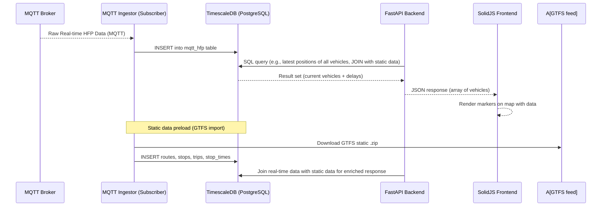

## Comprehensive Bussikartta Technical and Professional Guide (Updated)

This guide provides a highly detailed technical overview of the Bussikartta project, a real-time bus tracking system for Helsinki Regional Transport (HSL). It is tailored for developers, engineers, and end-users, covering architecture, development, deployment, data handling, and operational aspects.

### 1. Project Overview: Bussikartta

**Bussikartta** is a real-time transit tracking system designed for Helsinki Region Transport (HSL). It combines static schedule data with live vehicle telemetry to show real-time positions and delay information of buses on an interactive map.

#### 1.1. Key Functionalities
* **Static GTFS Schedule Import**: Imports routes, trips, stops, and timetables from HSL’s GTFS feed into a TimescaleDB database.
* **Live Data Ingestion**: Subscribes to HSL’s MQTT feed to receive live vehicle position updates and status events.
* **Delay Calculation**: Computes delays (ahead or behind schedule) by comparing live arrival times to scheduled times.
* **API for Clients**: Exposes REST and WebSocket endpoints via FastAPI for querying vehicles, delays, stops, and routes.
* **Interactive Frontend**: A SolidJS + Vite-based web app that displays bus positions and delays on an interactive vector tile map.
* **Containerized Setup**: Uses Docker Compose to orchestrate backend, frontend, tile server, and database services.

### 2. System Architecture

The Bussikartta system is built on a robust, containerized architecture, designed for stability, scalability, and maintainability.

#### 2.1. Core Components
* **Data Ingestion Pipeline:**
    * **GTFS Static Data Ingestion:** Responsible for fetching and processing GTFS static data (loading schedules and reference data) from HSL’s open data website (e.g., `https://infopalvelut.storage.hsldev.com/gtfs/hsl.zip`).
    * **Real-time Data Ingestion:** Subscribes to live vehicle position updates via an MQTT broker.
* **Core Database (TimescaleDB):** A PostgreSQL-based database optimized for time-series data. It stores both static transit data (routes, stops, timetables) and dynamic data (vehicle positions over time, updates). Using TimescaleDB’s **hypertables** allows efficient storage and querying of large sequences of timestamped location data.
* **FastAPI Application (Backend API):** A Python web API that exposes endpoints for clients (including the frontend). It handles incoming HTTP requests, queries the database, and returns JSON responses. It also contains business logic, such as computing delays by comparing real-time data with static schedules.
* **MQTT Client (Real-time Subscriber):** A background process responsible for subscribing to the MQTT broker for real-time HFP (Helsinki Region Transport's Public Transport Data) data.
* **Frontend (`frontend/`)**: A web application developed using SolidJS and Vite, utilizing MapLibre GL JS for rendering the interactive map.
* **Tile Server (`tileserver/`, optional)**: A Dockerized **Tileserver-GL** instance that serves `.mbtiles` generated by **Tilemaker** for offline map use.
* **Deployment**: The entire stack is containerized using Docker and managed with Docker Compose.

#### 2.2. Folder Structure (Key Directories)
The project adheres to a clear folder structure:
* `api/`: Contains the Python backend application (FastAPI-ready).
* `gtfs/`: GTFS static + realtime tools. (Note: `gtfs_static/` and `ingestion/` are detailed sub-components here).
* `scripts/`: CLI utilities.
* `tileserver/`: Optional offline tile server (vector).
* `docker-compose.yml`: Service orchestration.
* `README.md`: This file.
* `docs/`: Architecture, development, and data notes.

#### 2.3. Architecture Diagram
```
[ GTFS Feed ] ─── import_gtfs.py ──► [TimescaleDB Static GTFS Tables]
                   ↑
                   └─────────────────┐
                                     ▼
                                FastAPI Backend ◄─────────────
                   ▲           (REST APIs, WebSocket `/ws`)   │
                   │                                           │
[ HSL MQTT        └───────────────────────────────────────────►│
  Live Feed ]           MQTT Subscriber        Live Vehicle Data│
                                                         ▲     │
                                                         └─────┘
                                       SolidJS + MapLibre Frontend (WebSocket)
```
The system comprises several coordinated services.

### 3. For Developers & Engineers: Setup and Operations

#### 3.1. Quickstart: Launching the Stack
To set up and run the Bussikartta system, you'll need Docker installed.

1.  **Clone the repository:**
    ```bash
    git clone https://github.com/YOUR_ORG/bussikartta.git
    cd bussikartta
    ```
2.  **Launch the Docker stack:**
    ```bash
    docker compose up -d
    ```

#### 3.2. Access Points (Local Development)
Once the services are running, you can access them at the following local URLs:
* **Frontend Development Server:** `http://localhost:5173`
* **Backend REST API:** `http://localhost:8007/vehicles`
* **Backend WebSocket:** `ws://localhost:8007/ws`
* **(Optional) Offline tiles:** `http://localhost:8080`

#### 3.3. Docker Compose Configuration (`docker-compose.yaml`)
The `docker-compose.yaml` file orchestrates the multi-container application:

* **`api-server`**:
    * Builds from the current directory (`.`).
    * Maps host port `8007` to container port `5000`.
    * Environment variables configure PostgreSQL connection (`PGHOST`, `PGPORT`, `PGDATABASE`, `PGUSER`, `PGPASSWORD`).
    * Depends on the `db` service.
    * Mounts the current directory as `/app` for live code reloading during development.
* **`db`**:
    * Uses `timescale/timescaledb:2.15.2-pg15` Docker image.
    * Environment variables for PostgreSQL user, password, and database name (fetched from host environment).
    * Mounts a local volume `timescale-data` to `/var/lib/postgresql/data` for persistent database storage.
    * Maps host port `15432` to container port `5432`.
    * Includes a health check to ensure the PostgreSQL database is ready.
* **`backup`**:
    * An Alpine-based container for database backups.
    * Mounts the repository, a local `backups` directory, and the `timescale-data` volume.
    * The `entrypoint` runs `backup.sh` every 24 hours (86400 seconds).
* **`gtfs-static`**:
    * Builds from `./gtfs_static` context.
    * Configures database connection environment variables.
    * Depends on the `db` service.
* **`mqtt-ingest`**:
    * Builds from `./ingestion/mqtt_hfp_ingest` context.
    * Configures database connection environment variables.
    * Depends on the `db` service.
    * Restarts `unless-stopped`.
    * Mounts `./ingestion/mqtt_hfp_ingest` to `/app` and `/var/log` to `/var/log` in the container.
* **`vehicle-ingest`**:
    * Builds from the current context (`.`).
    * Sets `PYTHONUNBUFFERED=1`.
    * Working directory set to `/app/ingestion`.
    * Executes `python vehicle_positions_ingest.py`.
    * Depends on the `db` service.
* **`volumes`**: Defines `timescale-data` as a local volume, specifically binding to `/volume1/docker/hslbussit/repo/dbdata` on the host machine.
* **Defined Services**: `api-server`, `db`, `mqtt-ingest`, `gtfs-static`, `bussikartta-ui` (frontend), `bussikartta-map` (optional tile server).

#### 3.4. Backend API (FastAPI)

The backend is a FastAPI application that serves various endpoints for HSL data.

* **Main Application (`api/main.py`)**:
    * Initializes a `FastAPI` app with title "HSL Bus API", description "API for Helsinki Regional Transport data", and version "0.1.0".
    * Configures `CORSMiddleware` to allow requests from `http://192.168.3.114:5173` with credentials, all methods, and all headers.
    * Includes routers from various modules in `api/routes/`.
* **Database Connection (`api/db.py`)**:
    * Provides `get_db_connection()` using `psycopg2` to connect to PostgreSQL.
    * Database connection parameters are loaded from environment variables (`PGHOST`, `PGPORT`, `PGDATABASE`, `PGUSER`, `PGPASSWORD`).
* **API Endpoints (`api/routes/*.py`)**:
    * `/` (from `__init__.py`): A basic test endpoint returning `{"message": "__init__.py endpoint working"}`.
    * `/agency`: Returns static HSL agency information.
    * `/alerts`: Retrieves active alerts.
    * `/calendar`: Fetches calendar data.
    * `/emissions`: Provides vehicle emission data.
    * `/fare_attributes`: Returns fare attributes.
    * `/fare_rules`: Fetches fare rules.
    * `/feed_info`: Retrieves feed publisher information.
    * `/routes`: Provides route details.
    * `/stops`: Returns stop information.
    * `/transfers`: Fetches transfer rules.
    * `/trips`: Retrieves trip details.
    * `/vehicle_positions`: Returns the latest 100 vehicle positions.
    * `/vehicles` (REST): Snapshot of latest positions. Returns current live vehicle positions including `vehicle_id`, `label`, `lat`, `lon`, `speed`, and `timestamp`.
    * `/ws` (WebSocket): Streams JSON payloads every second with updated vehicle positions.

* **Backend API JSON Format for `/vehicles` (example)**:
    ```json
    {
      "vehicle_id": "1234",
      "label": "600N",
      "lat": 60.17,
      "lon": 24.94,
      "speed": 33.0,
      "timestamp": "2025-06-19T00:00:00Z"
    }
    ```
* **Dependencies (`api/requirements.txt`)**:
    * `fastapi`
    * `uvicorn`
    * `psycopg2-binary`
    * `requests`
    * `protobuf`
    * `gtfs-realtime-bindings`

#### 3.5. Data Ingestion

The system handles both static GTFS and real-time vehicle data. All pipeline services (static GTFS, RT ingestion, database writing) have been verified, and inter-service dependencies are consistent.

#### 3.5.1. GTFS Data Handling Overview
GTFS (General Transit Feed Specification) is a standard format for public transit schedules and associated geographic information. Bussikartta uses GTFS static data to know where and when vehicles are supposed to be, displaying route and stop names, and comparing actual timing to schedules to compute delays. GTFS is split into GTFS Static (schedules) and GTFS Realtime (live updates via protocol buffers or other formats).

#### 3.5.2. GTFS Static Data Handling
* **Purpose:** GTFS static data (routes, stops, timetables) provides the planned context for real-time vehicle data.
* **Source:** HSL provides a daily-updated GTFS feed.
* **Download:** The system downloads the GTFS Zip file from a known URL (e.g., `https://infopalvelut.storage.hsldev.com/gtfs/hsl.zip`).
* **Import Process (`gtfs_static/main.py`)**:
    1.  **Unzip and Parse CSV Files:** The GTFS zip contains multiple text files (CSV format). Key files parsed include `agency.txt`, `stops.txt`, `routes.txt`, `trips.txt`, `stop_times.txt`, `calendar.txt`, `calendar_dates.txt`, and optionally `shapes.txt`.
    2.  **Database Import:** Parsed data is inserted into database tables like `stops`, `routes`, `trips`, `stop_times`, `calendar`, and `calendar_dates`. Appropriate indexing is ensured. Static loader inserts use `ON CONFLICT` upserts for `agency`, `stops`, `routes`, `trips`.
    3.  **Data Refresh vs. Update:** For updates, the process can involve wiping and replacing tables (simpler, but causes downtime) or a more complex diff and update. Bussikartta likely uses a strategy that ensures old data remains in place until new data is fully applied.
    4.  **Verification:** Optional verification of counts and logging of success are performed after import.
* **Updating GTFS Data:** HSL provides daily updates. The process typically involves fetching the latest zip, temporarily stopping real-time ingestion, running the import script to refresh static tables, and then resuming normal operation. Advanced strategies like loading into temporary schemas can minimize downtime.
* **Cross-Referencing Static and Real-Time Data**: This is crucial for combining static schedule info with live data.
    * **Matching Vehicles to Trips:** Real-time vehicle updates are associated with a planned trip, often using `trip_id` or inferred from `start` time and `oper` (operational number) in the HFP feed.
    * **Using Stop Times for Delays:** Once linked to a trip, actual timestamps are compared to planned times in `stop_times` to compute delays. This can be computed on the fly or stored in the `vehicle_positions` table.
    * **Enriching API Responses:** Static data enables the API to provide user-friendly information like `route_short_name` (e.g., “550”) and `route_long_name` (“Westendinasema - Itäkeskus”) instead of just IDs.
    * **Handling Schedule Exceptions:** The system can use `calendar` and `calendar_dates` to identify active trips for a given day.

#### 3.5.3. GTFS Real-time Data (MQTT HFP)
* **MQTT Broker:** `mqtt.hsl.fi` on ports `1883` or `8883`.
* **Topic:** `/hfp/v2/journey/#`. The specific topic subscribed to by `mqtt_hfp_ingest/main.py` is `/hfp/v2/journey/ongoing/vp/bus/#`.
* **Listener/Ingestor (`ingestion/mqtt_hfp_ingest/main.py`)**: This is the primary listener for real-time MQTT data.
* **Output Table:** Ingested MQTT data is stored in the `mqtt_hfp` hypertable.
    * *Observation:* The `mqtt_hfp` table schema has been extended with columns like `tsi` and `odo`, and its primary key was updated to `(tst, veh)` to resolve duplicate insert issues.
* **Vehicle Positions Ingestion (`ingestion/vehicle_positions_ingest.py`)**: Another component responsible for processing vehicle positions. GTFS RT vehicle positions are inserted into `vehicle_positions`.
* **GTFS-Realtime (Protocol Buffers) Handling**: While HSL uses JSON-over-MQTT, the architecture could accommodate GTFS-RT protobuf format, which provides Vehicle Positions, Trip Updates, and Service Alerts. Google’s `gtfs-realtime-bindings` for Python can decode these.

#### 3.5.4. Detailed Data Flow
The data flow illustrates how real-time data is ingested and served, using static data for context.


This illustrates how real-time data flows in and how the API serves it out to users, using the static data for context. Each component works independently yet in concert as part of the whole system architecture.

### 3.6. Frontend Architecture (SolidJS)

The frontend is designed for blazing-fast real-time map rendering of 5,000+ vehicles.

* **Technology Stack:**
    * **Framework:** SolidJS (chosen for ultra-fast, minimal re-renders).
    * **Build Tool/Dev Server:** Vite (`npm run dev`).
    * **Map Rendering Engine:** MapLibre GL JS (WebGL-based).
    * **Language:** TypeScript (ensures safety and structure in the codebase).
    * **Live Updates:** WebSocket (push-based live updates every 1 second).
    * **Docker (optional)**: For static build + container deployment.
* **Architecture Summary:**
    * Map rendering is handled directly by MapLibre GL JS, fed with GeoJSON sources.
    * Live updates are pushed from the backend WebSocket `/ws` and injected into the map's data source using `setData()`.
    * The app avoids unnecessary DOM elements — vehicle markers are rendered by the map engine itself.
    * Core state (vehicle data) is reactive and drives UI updates.
* **Component Breakdown:**
    * `<MapView>`: Initializes MapLibre map and loads vehicle markers.
    * `<VehiclePopup>`: (Optional) Shows label + speed for selected vehicle.
    * `<Controls>`: Filter, zoom, route selector (optional UI).
    * `<Header>`/`<Footer>`: Branding, data source, timestamps.
* **Map Tile Source:**
    * **Online**: HSL vector tile service (`hsl-vector-map`) from `cdn.digitransit.fi`.
    * **Offline**: `.mbtiles` hosted locally via **Tileserver GL**, generated by **Tilemaker**.
* **Frontend Data Flow:**
    ```mermaid
    sequenceDiagram
      participant Server as Backend (FastAPI)
      participant Client as SolidJS Frontend
      participant Map as MapLibre Map

      Server-->>Client: WebSocket JSON (every 1s)
      Client->>Map: Replace vehicle GeoJSON via setData()
      Client->>UI: (Optional) update timestamp, info overlays
    ```
* **Development Notes:**
    * Run `npm run dev` in the frontend folder (powered by Vite).
    * Open browser to `http://localhost:5173`.
    * Ensure backend WebSocket on `/ws` (e.g. port 8007) is reachable.
    * Tile style can be switched using standard MapLibre `style` config.
    * GeoJSON source must be promoted by ID to allow efficient layer updates.
* **Locked Technologies:**
    * SolidJS + Vite
    * MapLibre GL JS
    * WebSocket for real-time transport (no polling, no React Query)
    * Vector tiles (HSL online or offline via mbtiles, generated via Tilemaker)
    * Backend maintained and included in architecture
    * Fully Dockerized infrastructure

#### 3.8. Maintenance & Operations

#### 3.8.1. Backup Script (`backup.sh`)
* **Purpose:** Performs daily backups of the PostgreSQL data directory.
* **Mechanism:** Compresses the `/var/lib/postgresql/data` directory into a `.tar.gz` file named with a timestamp and stores it in `/backups`.
* **Retention Policy:** Keeps only the last 7 backups, automatically deleting older ones.
* **Automation:** Integrated into Docker Compose via the `backup` service, running every 24 hours.

#### 3.8.2. Watchdog & Cron Tools (`tools/`)
These shell scripts are designed for monitoring and ensuring service health:
* **`mqtt_watchdog.sh`**: Verifies that live MQTT ingestion is active.
* **`vehicle_watchdog.sh`**: Checks if recent vehicle positions exist in the database, indicating successful data flow.
These scripts are intended for use with a cron scheduler or log-based monitoring systems.

#### 3.8.3. Logging & Debugging Standards
The system adheres to comprehensive logging standards as outlined in the `AI-Guidelines.md`:
* **Components:** Backend, Frontend, and Infrastructure logs are required.
* **Format:** Log output must be timestamped, use defined log levels (`debug`, `info`, `warn`, `error`), and be readable/actionable.
* **Retention:** Logging should be on by default, with log rotation and retention limits.
* **Security:** **Crucially, never include credentials, secrets, or sensitive tokens in logs or code output.** Sensitive data must be handled via environment variables, secrets managers, or secured DSM vault features.

### 4. For End Users

Bussikartta provides a user-friendly interface to track HSL buses in real-time.

* **Functionality:** The system allows you to see live vehicle positions on a map, including current location, speed, and direction of buses.
* **Data Presented:**
    * **Live Vehicle Positions:** Displays buses on the map with details like `vehicle_id`, route `label`, `latitude`, `longitude`, `speed`, and `timestamp`.
    * **Routes and Stops:** Integrates static GTFS data to provide context, showing planned routes, bus stops, and potentially timetable information.
    * **Alerts and Fare Information:** The system has the capability to display real-time alerts and fare-related attributes, enriching the user experience.
* **Access:** While the provided context details a development setup (e.g., `http://localhost:5173`), in a production environment, end-users would typically access Bussikartta through a publicly available web address.

### 5. Development Guidelines (for AI Engineers)

The `docs/AI-Guidelines.md` file provides strict rules for AI engineers contributing to this project. Key aspects include:
* **Output & Code Delivery:** Always deliver full, drop-in file replacements; ensure output is executable as-is and production-ready for DSM 7.2.2 on Synology DS9923+. Every major change requires a version note or changelog summary.
* **AI Responsibilities:** AI is the engineer, responsible for designing solutions, reading existing files, making verified changes, and providing exact, authoritative code replacements without guessing or suggesting edits.
* **Human-AI Workflow:** The user runs commands and pastes code, while the AI owns the codebase, writes all changes, and validates feedback. Users do not manually edit code.
* **Terminal & Editor Usage:** User utilizes `vi` for terminal edits and BBEdit for desktop editing. Absolute paths are always specified.
* **Task & Context Management:** Track active tasks, use temporary tasks for debugging, and request specific output when unsure about file content or project structure. Avoid looping on broken solutions.
* **Operational Expectations:** Each major response must detail what happened or what's next, exact files/directories touched, and task status. Maintain awareness of system constraints and project history.

This guide provides a foundational understanding of the Bussikartta project, enabling effective collaboration and development.