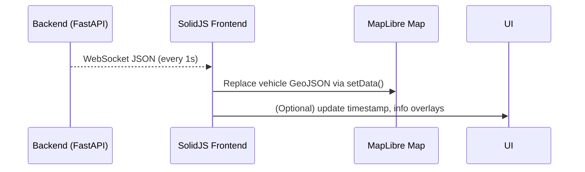

# Frontend Architecture (Updated)

This document defines the architecture for the **Bussikartta** frontend, designed for blazing-fast real-time map rendering of 5,000+ vehicles.

---

## 🧱 Technology Stack

| Technology      | Purpose                                              |
|------------------|------------------------------------------------------|
| SolidJS         | Core UI framework (ultra-fast, minimal re-renders)   |
| Vite            | Build tool + dev server (`npm run dev`)              |
| MapLibre GL JS  | WebGL-based map rendering engine                     |
| TypeScript      | Ensures safety and structure in the codebase         |
| WebSocket       | Push-based live updates every 1 second               |
| Docker (optional) | For static build + container deployment            |

---

## 🧠 Architecture Summary

- **Map rendering** is handled by **MapLibre GL JS**, fed with GeoJSON sources.
- **Live updates** are pushed from the backend WebSocket `/ws` and injected into the map's data source using `setData()`.
- The app avoids unnecessary DOM elements — vehicle markers are rendered by the map engine itself.
- Core state (vehicle data) is reactive and drives UI updates.

---

## 🔧 Component Breakdown

| Component             | Role                                                          |
|-----------------------|---------------------------------------------------------------|
| `<MapView>`           | Initializes MapLibre map and loads vehicle markers            |
| `<VehiclePopup>`      | (Optional) Shows label + speed for selected vehicle           |
| `<Controls>`          | Filter, zoom, route selector (optional UI)                    |
| `<Header>`/`<Footer>` | Branding, data source, timestamps                             |

---

## 🗺 Map Tile Source

- **Online**: HSL vector tile service (`hsl-vector-map`)
- **Offline**: `.mbtiles` hosted locally via **Tileserver GL**

---

## 🔄 Data Flow

---

## 🧪 Dev Notes

- Run `npm run dev` in the frontend folder (powered by Vite).
- Open browser to `http://localhost:5173`
- Ensure backend WebSocket is reachable on `/ws` (e.g. port 8007).
- Tile style can be switched using standard MapLibre `style` config.
- GeoJSON source must be promoted by ID to allow efficient layer updates.

---

## ✅ Locked Technologies

- SolidJS + Vite
- MapLibre GL JS
- WebSocket (no polling, no React Query)
- Vector tiles (HSL online or offline via mbtiles)

---

© HSL Bussikartta 2025
