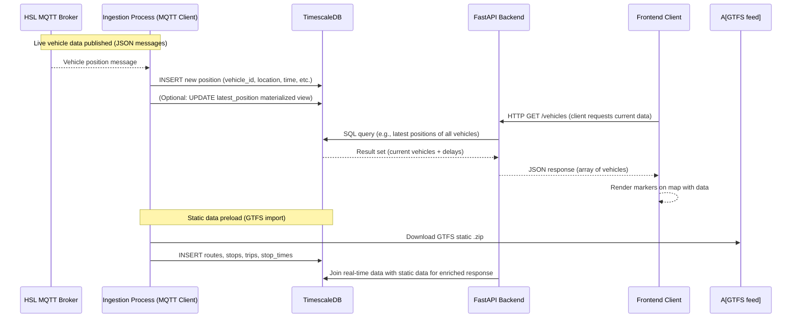

# Project Architecture

This document provides an in-depth overview of Bussikartta’s backend architecture, covering its components, data flow, database design, and the principles behind its design. The focus is on how the system ingests data (both static and real-time), how it stores and organizes that data in TimescaleDB, and how the FastAPI backend serves it via a well-defined API.

## System Overview

Bussikartta’s backend is structured as a set of cooperating components, each with a clear role:

- **Data Ingestion Pipeline:** Responsible for fetching and processing data from external sources. This includes **GTFS static data ingestion** (loading schedules and reference data into the database) and **real-time data ingestion** (subscribing to live vehicle position updates via MQTT).
- **Core Database (TimescaleDB):** A PostgreSQL-based database optimized for time-series. It stores both static transit data (routes, stops, timetables) and dynamic data (vehicle positions over time, updates). Using TimescaleDB’s hypertables allows efficient storage and querying of large sequences of timestamped location data.
- **FastAPI Application (Backend API):** A Python web API that exposes endpoints for clients (including the frontend). It handles incoming HTTP requests, queries the database as needed, and returns JSON responses. It also contains any business logic (e.g., computing delays by comparing real-time data with static schedules).
- **MQTT Client (Real-time Subscriber):** A background task or separate module in the backend that maintains a connection to the MQTT broker broadcasting vehicle positions. It listens for messages on specific topics and processes each message (e.g., parsing the vehicle’s data and inserting a new record into the database).
- **Planned Frontend (React App):** Although primarily a consumer of the API (and documented separately), it’s part of the overall architecture. The frontend makes requests to the FastAPI backend to retrieve current vehicle positions, route info, etc., and visualizes them. In the future, a WebSocket or similar push mechanism might be added to stream updates to the frontend.

Below is a high-level diagram of how these components interact:

```mermaid
flowchart LR
    subgraph External Sources
        A[GTFS Static Feed<br>(Schedule Data)]
        B[HSL MQTT Broker<br>(Real-time Data)]
    end
    subgraph Bussikartta Backend
        C[GTFS Ingestion<br>Module]
        D[MQTT Subscriber<br>Module]
        E[(TimescaleDB)]
        F[FastAPI REST API]
    end
    subgraph Frontend Client
        G[React Map UI]
    end

    A -- GTFS ZIP --> C
    B -- Live messages --> D
    C -- Schedule records --> E
    D -- Vehicle position inserts --> E
    F -- Read/Write --> E
    G -- API calls --> F
    F -- JSON data --> G
```

**Figure: System architecture and data flow.** Solid arrows indicate data flow: GTFS static data is downloaded by the ingestion module and stored in the database; real-time messages stream from the HSL MQTT broker to our subscriber which writes them to the database. The FastAPI API reads from (and occasionally writes to) the database, serving client requests. The frontend interacts with the system purely via the API.

## Components and Responsibilities

### FastAPI Backend (API Server)
The FastAPI application is the central piece that clients interact with. It provides organized endpoints (RESTful routes) to retrieve information like current vehicles, routes, stops, etc. Key characteristics of the API server:
- **Routing & Logic:** The code is likely organized into routers or controllers by domain (vehicles, routes, stops). Each endpoint handler will query the database (using an async database client or an ORM/SQL) and assemble the result.
- **Pydantic Models:** FastAPI uses Pydantic for defining request/response data models. The API likely defines schemas (for example, a `Vehicle` model with fields like id, latitude, longitude, route, delay, etc.) to ensure consistent output.
- **Async I/O:** FastAPI supports asynchronous operation. Database queries and MQTT handling can run asynchronously so that the server remains responsive under load. This is important given potentially high frequency of incoming data.
- **Background Tasks:** The API server can spawn background tasks. Bussikartta might use this for the MQTT subscription – for example, on startup, launch a background task to connect to the broker and process messages continually. Alternately, the MQTT ingestion could run as a separate process/service (depending on design).
- **Auto-Documentation:** By leveraging FastAPI, the backend automatically provides an OpenAPI schema and interactive docs at `/docs`. This is useful for developers to explore the available endpoints.

### Data Ingestion Pipeline
The ingestion pipeline has two major parts: **static data ingestion** and **real-time data ingestion**.

- **GTFS Static Ingestion:** This is typically a batch process triggered manually or on a schedule. It fetches the GTFS static zip file (for HSL, updated daily【27†L65-L72】) and parses the included CSV files. The system then upserts this data into the database:
  - *Stops* (stop locations and details),
  - *Routes* (definitions of each bus/tram line),
  - *Trips* (specific instances of routes, usually a single vehicle’s journey for a day),
  - *Stop Times* (the scheduled times each trip serves each stop),
  - and possibly *Shapes* (geographic route paths) if provided and needed.
  
  After parsing, the ingestion routine populates the corresponding tables in TimescaleDB. This may involve creating or refreshing indexes (for example, an index on `stop_id`, or on `route_id` in the trips table for quick lookups).

- **Real-time MQTT Ingestion:** This runs continuously to keep the system updated with live vehicle positions:
  - The system connects to the **HSL high-frequency positioning MQTT API** (broker). The default broker is `mqtt.hsl.fi` on port 1883, with no authentication required for HSL’s public data【29†L23-L31】. We subscribe to the topic pattern `"/hfp/journey/#"`, which receives **all vehicle position messages** in the HSL area【29†L31-L39】.
  - Each message is a JSON payload (HSL uses a custom JSON format for HFP data, as opposed to standard GTFS-RT protobuf for other regions【46†L71-L78】). The payload contains details such as vehicle ID, latitude, longitude, heading, speed, route (usually a line code or destination sign `desi`), trip identifiers, next stop, timetable adherence, etc.
  - The MQTT subscriber module (using an MQTT client library like Paho MQTT) handles incoming messages in a loop. For each message:
    - Parse the JSON to extract relevant fields (vehicle ID, coordinates, timestamp, route ID, next stop, etc.). For example, the message might have a structure like `{"VP": { "veh": "<vehicle_id>", "lat": 60.1705, "long": 24.9312, "spd": 13.0, "desi": "550", "route": "1050", "tsi": 1687000000, ... }}`【29†L33-L41】.
    - Insert a new record into the **vehicle_positions** table in the database. This table is a time-series (hypertable) capturing each position report.
    - Optionally, update a separate “latest position” cache or table for quick access to current state (to avoid querying huge time-series for latest data each time). In TimescaleDB, one might use a continuous aggregate or a materialized view to get the latest position per vehicle efficiently, or maintain a small table keyed by vehicle_id.
    - Compute delay if possible: The message or subsequent processing can calculate how late the vehicle is. If the real-time feed includes a delay field or next stop and scheduled time, the ingestion could compute `delay = actual_arrival_time - scheduled_time` for that stop. If not computed on the fly, the API can compute delay when serving data by comparing the current timestamp with the trip’s schedule from GTFS.

  - The subscriber runs endlessly, and it should handle reconnections gracefully. If the MQTT connection drops or broker is unavailable, the system will attempt to reconnect, ensuring robustness. This guarantees continuous data flow with minimal downtime in data collection.

### Database: TimescaleDB Schema and Design

All data is stored in a TimescaleDB instance. TimescaleDB is chosen because it extends PostgreSQL with time-series optimizations, which is ideal for storing frequent vehicle position updates over time. Key points of the database design:

- **Schema Overview:** The database likely has tables corresponding to GTFS static data and tables for dynamic data:
  - **agency, routes, stops, trips** – GTFS static reference tables.
  - **stop_times** – Detailed schedule times (could be large, but indexed by trip and stop for lookup).
  - **vehicle_positions** – The main time-series table for real-time data. Each row could contain:
    - a unique ID (maybe auto or a composite of vehicle+timestamp),
    - vehicle identifier,
    - route or trip reference,
    - timestamp of the observation,
    - latitude & longitude,
    - possibly heading, speed,
    - next_stop and/or last_stop passed,
    - delay or schedule deviation (if calculated at insert time).
  - **current_vehicles** – (Optional) a materialized view or table that always holds the latest record per vehicle (for quick reads). This can be generated by a continuous aggregate in Timescale or maintained by upsert logic in the application.

- **Hypertable & Partitioning:** The `vehicle_positions` table is created as a **hypertable**, partitioned by the timestamp (time column). This means under the hood TimescaleDB splits the data into time “chunks” (e.g., weekly or monthly partitions) for efficiency. This structure improves insert performance and makes queries on time ranges faster. The time index also ensures queries like “get all positions in the last 5 minutes” are very fast.
  - We might also partition by space or vehicle ID as a secondary dimension if needed (Timescale supports space partitioning), but likely time partitioning alone is sufficient for our use case.
  
- **Indexes:** Traditional B-tree indexes would be added on key lookup fields:
  - Index on `vehicle_id` (perhaps composite with timestamp for finding latest position of a given vehicle quickly).
  - Index on `trip_id` in positions (to retrieve all positions for a particular trip).
  - Spatial index: If PostGIS is enabled, the positions table might have a `GEOGRAPHY(Point)` column for lat/lon and an index for geospatial queries (e.g., find all vehicles within a bounding box). If needed, a GiST index on location could support mapping the vehicles in a certain area.
  - Indexes on static tables: e.g., `stops(stop_id)`, `routes(route_id)`, etc., as they are often joined or searched by these IDs. These tables are relatively small and static, so simple indexes suffice.

- **Relational Links:** We maintain foreign-key-like relationships at the application level:
  - `vehicle_positions.route_id` (or trip_id) corresponds to a route/trip in the static tables. This allows joins to fetch route names or stop schedules.
  - `trips.route_id -> routes.route_id` etc., linking trips to their parent route.
  - `stop_times.trip_id -> trips.trip_id` and `stop_times.stop_id -> stops.stop_id` linking schedule times.
  
  The system can use these links to combine static and real-time data. For example, to compute delay: find the next stop for a vehicle’s current trip and subtract the scheduled arrival from current time.

- **Performance and Volume:** The database is expected to handle a high volume of inserts (each vehicle sending data perhaps every few seconds). TimescaleDB’s internal compression and partitioning help manage this volume long-term:
  - Older data can be **compressed** to save space (TimescaleDB allows compressing chunks older than a threshold, e.g., compress data older than 1 week, reducing storage by 90%+ for historical points).
  - Data retention policy can be implemented to drop very old data (if we only care about, say, the last 1 year of data, we could drop older chunks).
  - **Continuous aggregates** can summarize data over time (not heavily used in real-time display, but for reporting average delays by hour or similar, these pre-computed aggregates are useful).
  
  These strategies ensure the system remains scalable as data grows, and queries remain fast. The choice of TimescaleDB (on PostgreSQL) provides a robust, scalable platform for handling the time-series data with standard SQL【50†L315-L323】.

Below is a simplified Entity-Relationship diagram of the core database tables:

```mermaid
erDiagram
    ROUTES ||--o{ TRIPS : contains
    TRIPS ||--o{ STOP_TIMES : has
    STOPS ||--o{ STOP_TIMES : served_by
    TRIPS ||--o{ VEHICLE_POSITIONS : produces
    ROUTES ||--o{ VEHICLE_POSITIONS : references
    
    ROUTES {
        string route_id PK
        string short_name
        string long_name
        string mode
        string agency_id
        /* ... other route info ... */
    }
    STOPS {
        string stop_id PK
        string name
        float lat
        float lon
        string zone_id
        /* ... other stop info ... */
    }
    TRIPS {
        string trip_id PK
        string route_id FK "routes.route_id"
        string service_id
        string headsign
        int direction_id
        /* ... other trip info ... */
    }
    STOP_TIMES {
        string trip_id FK "trips.trip_id"
        string stop_id FK "stops.stop_id"
        time arrival_time
        time departure_time
        int stop_sequence
        /* PK could be (trip_id, stop_sequence) */
    }
    VEHICLE_POSITIONS {
        int id PK
        timestamp observation_time
        string vehicle_id
        string trip_id (or route_id) 
        float latitude
        float longitude
        int delay_seconds
        string next_stop_id
        /* ... any other fields like speed, heading ... */
    }
```

*Diagram: Core database tables.* **Routes**, **Stops**, **Trips**, **Stop_Times** come from GTFS static data. **Vehicle_Positions** stores real-time updates. The diagram shows logical relationships (dotted FK links) used when querying, even if not all are formal foreign keys (for flexibility and performance). For instance, each vehicle position row can reference a trip (or directly a route) to tie it to schedule info.

### MQTT Broker and Topics

The system relies on an external MQTT broker for real-time data. For HSL (Helsinki Region), the broker is `mqtt.hsl.fi` and it publishes a feed called HFP (High Frequency Positioning). The topics follow a certain structure (HSL’s custom format, not standard GTFS-RT), which encodes various fields in the topic string. We subscribe using a wildcard to get all vehicles:
- **Broker:** `mqtt.hsl.fi` (standard MQTT port 1883)【29†L23-L31】. No username/password needed for HSL’s public feed.
- **Topic:** `/hfp/journey/#` – this catches all messages under the “journey” topic hierarchy【29†L31-L35】. In HSL’s format:
  - A full topic example might be `/hfp/journey/v1/1/+/+/1045/1/22/HSL:1045_20210609_Ti_2_0715/Kaivoksela/22/1290/60;24/17/28/39/551/` (this is illustrative). The path encodes things like mode, route, direction, headsign, trip, vehicle, etc.
  - We don’t parse the topic string in detail because the payload contains a JSON object with the same info.
- **Message Payload:** JSON with a structure, typically: 
  ```json
  {
    "VP": {
      "veh": "<vehicle_id>",
      "lat": <latitude>,
      "long": <longitude>,
      "hdg": <heading>,
      "spd": <speed>,
      "tsi": <timestamp_epoch>,
      "desi": "<destination_sign_code>",
      "route": "<route_id>",
      "dir": <direction_id>,
      "oper": <operator_id>,
      "odo": <odometer>, 
      "drst": <door_status>,
      "stop": "<last_or_next_stop_id>",
      "route_type": <mode>
      /* etc., additional fields */
    }
  }
  ```
  Fields like `desi` (destination / line name) and `route` help map to the actual route. The `stop` field usually gives the next stop (or last passed stop) ID, which we use to find schedule times. `tsi` is a timestamp. Some feeds include a `delay` or schedule deviation, but HSL’s HFP might require computing delay manually. We store the relevant fields in the database. 

The MQTT topic structure and data allow the system to capture not only location, but also identify which trip the vehicle is on and what its next stop is, enabling the calculation of lateness against the GTFS schedule.

*(For other cities using Waltti/digitransit MQTT, the system could be configured with their broker and topics. Those use GTFS-RT protobuf messages under topics like `gtfsrt/vp/<city>` as per Digitransit documentation. Our design keeps the MQTT broker URL and topic as configurable parameters.)*

### API-Database Interaction

The FastAPI backend interacts with the database primarily for read operations (serving GET requests), but also some writes (inserting data via ingestion). Notable patterns:
- Using parameterized SQL or an ORM (like SQLAlchemy or Tortoise ORM) to query data. For example, to get all current vehicles, we might query the `vehicle_positions` table for the latest timestamp per vehicle.
- Views or optimized queries: To avoid heavy aggregation on each request, the system might utilize a SQL **view** or a **continuous aggregate** in TimescaleDB that always surfaces the most recent position per vehicle. The API can query this view (e.g., `SELECT * FROM latest_vehicle_positions;`) which is much faster than scanning the raw positions table each time.
- Joining static and dynamic data: Endpoints that need route or stop names will join the static tables. For instance, an API response for a vehicle may include the route’s short name and the next stop’s name by joining `routes` and `stops` based on IDs.
- Connection management: The app maintains a pool of DB connections. In async context, an async PG driver (like `asyncpg` or via SQLAlchemy Async) is used. The `DB_HOST`, `DB_USER`, etc., from config are used to connect. In Docker Compose, the service name (e.g., `db`) is used as host.
- Error handling: If a query fails or data is not found, the API returns appropriate HTTP errors (404 for not found, etc.). The architecture ensures these are handled gracefully.

## Key Design Principles

Several design considerations have guided the architecture:

- **Separation of Concerns:** Each component (ingestion, API, storage) has a single responsibility. This makes the system easier to maintain and scale. For example, one can update the frontend or modify how data is ingested without altering how the API endpoints are defined (as long as the DB schema contracts are maintained).
- **Scalability:** Both vertically and horizontally. Using TimescaleDB on PostgreSQL provides proven scalability for time-series (billions of rows) on a single node, and options for distributed set-ups if needed. The stateless FastAPI app can be run in multiple replicas behind a load balancer to handle more traffic. The MQTT ingestion could be scaled or split by topic (e.g., one process for each city’s feed) if monitoring multiple regions.
- **Real-time Performance:** The choice of an in-memory async server (Uvicorn/FastAPI) and pushing computations to the database (which is optimized in C) ensures that even as data updates rapidly, the users see timely responses. The use of MQTT (push) means we don’t poll for updates, reducing latency and bandwidth; updates are processed as soon as they arrive【46†L71-L78】.
- **Consistency and Integrity:** Static data and real-time data must stay in sync. The architecture assumes GTFS static data is updated whenever schedules change, to avoid mis-computation of delays. Transactions and careful order of operations in ingestion ensure, for example, that we don’t insert a vehicle position referencing a trip that doesn’t exist in the DB. Static data loads might be done in a transaction or to a temporary schema and then swapped, to ensure the API always sees a consistent set of static data.
- **Maintainability:** The codebase is organized into modules (perhaps `api/routes.py`, `ingest/mqtt_client.py`, `db/models.py`, etc.). This modular architecture allows new features (like adding a new endpoint or supporting a new data source) without large-scale rewrites. Configuration is externalized (via environment variables or config files) to avoid hard-coding endpoints or secrets. Documentation (like this) is provided to help new developers quickly understand the system.
- **Fault Tolerance:** The system handles failures gracefully. If the MQTT feed goes down (which can happen due to network issues), the ingestion will keep retrying connection and not crash the entire app. The database is the single source of truth – short outages in the feed or API won’t corrupt it. We also include backup mechanisms (see Deployment docs) to regularly save the database state, adding to stability in case of data loss or migration needs.

## Performance Considerations

- **High Ingest Rate:** With potentially thousands of vehicles each sending positions every 1–10 seconds, the insert rate can be high. TimescaleDB is tuned for high ingest, but we also batch inserts if possible. For example, the MQTT client could batch multiple incoming messages in a short window and do a bulk insert transaction, which is more efficient than single-row inserts.
- **Query Optimization:** Endpoints like “get all vehicles now” are optimized via database views or by storing derived data (like current position). We avoid heavy computations in Python for each request; instead, delegate filtering/sorting to SQL (which is faster in-set). For spatial filtering (e.g., if we add an endpoint to get vehicles in a bounding box), using a spatial index in the DB will allow those queries to be fast.
- **Caching:** While not yet implemented, the architecture allows adding caching layers:
  - In-memory caching in the API for frequently requested data that doesn’t change often (e.g., static lists of routes or stops).
  - HTTP caching headers for static endpoints (like a `/routes` list could be cached by clients for a day since routes rarely change).
  - CDN or reverse proxy caching if this were a public API to reduce load.
- **Parallelism:** FastAPI with Uvicorn can handle many concurrent connections. Database pooling ensures multiple queries can be handled in parallel up to a limit. The design should avoid global locks. Python’s GIL is not a major issue here since most work is I/O (DB calls, network) which is done asynchronously.
- **Memory Usage:** The backend keeps static data in the DB and only pulls what’s needed per request. We avoid loading entire schedules into memory within the app. The MQTT messages are processed on the fly and not stored in memory beyond what’s needed to form the SQL insert. This keeps the memory footprint of the app modest.

In summary, the Bussikartta project architecture emphasizes a clear split between data collection, data storage, and data serving. By using the right tools for each (MQTT for push data, TimescaleDB for storage, FastAPI for service layer), it achieves real-time responsiveness and scalability. The design is robust against common issues (data feed hiccups, large data volume, concurrent access) and is maintainable for future extensions (like supporting new regions, adding analytics features, or enhancing the frontend). The next sections of the documentation will delve into specific aspects, such as how GTFS data is handled and how the frontend is structured, complementing this high-level overview.

## Diagram Summary

For easy reference, here is a summary diagram highlighting the ingestion pipeline and component interactions in another form – a sequence diagram:



This illustrates how real-time data flows in and how the API serves it out to users, using the static data for context. Each component works independently yet in concert as part of the whole system architecture.

---

In conclusion, Bussikartta’s backend architecture is built for **stability**, **scalability**, and **maintainability**. It leverages proven technologies and patterns (publish/subscribe for real-time, relational model for static data, time-series optimizations for history, REST API for integration) to ensure that live transit data can be collected, stored, and delivered effectively to any client application.


> **Updated by system audit on 2025-06-18 19:10 UTC.**


## 🔍 Observations

- `mqtt_hfp` table schema has been extended with columns like `tsi`, `odo`, etc.
- Primary key updated to `(tst, veh)` to resolve duplicate insert issues.

## ✅ Status

- All pipeline services (static GTFS, RT ingestion, database writing) verified.
- Inter-service dependencies (e.g. database environment vars) are consistent.

